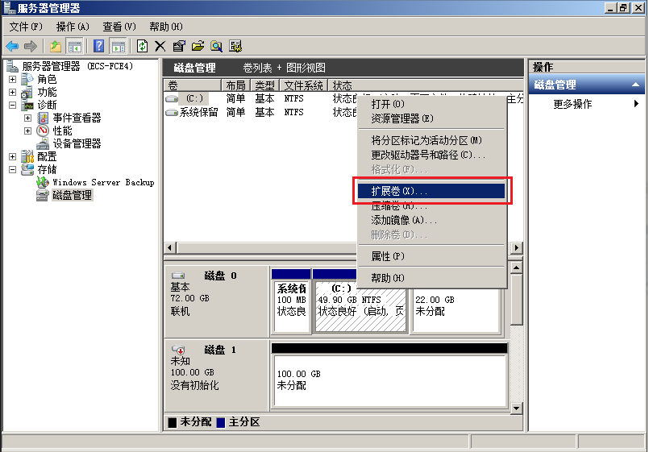
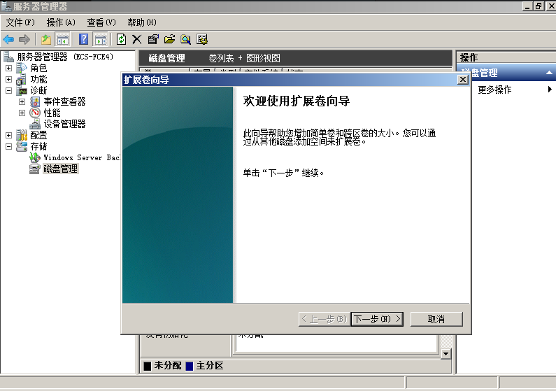

# Windows磁盘扩容后处理

## 操作场景

通过云服务管理控制台扩容成功后，对于Windows操作系统而言，需要登录云服务器将扩容部分的容量增加到原有的磁盘中，或者为扩容部分的容量新创建一块磁盘。

本文以“Windows Server 2008 R2 Enterprise”操作系统为例。提供以下扩容方法：

-   系统盘：扩大C盘的容量。
-   数据盘：已有D盘的情况下，将扩容部分的容量增加到D盘中。

    如果需要新增E盘，则不适用扩容场景，需要您新创建一块此盘挂载至云服务器，并初始化后使用。

不同操作系统的操作可能不同，本文仅供参考，具体操作步骤和差异请参考对应操作系统的产品文档。

> **须知：** 
>扩容时请谨慎操作，误操作可能会导致数据丢失或者异常，建议扩容前对数据进行备份，可以使用CBR功能，请参见[管理备份磁盘](管理备份磁盘.md)。

## 前提条件

-   已登录云服务器。
    -   裸金属服务器请参见《裸金属服务器用户指南》。
    -   弹性云服务器请参见[登录弹性云服务器](https://support.huaweicloud.com/qs-ecs/zh-cn_topic_0092494193.html)。
    -   裸金属服务器请参见[登录裸金属服务器](https://support.huaweicloud.com/qs-bms/bms_qs_0004.html)。

-   已挂载磁盘至云服务器，且该磁盘的扩容部分未分配分区。

## 系统盘（将扩容部分的容量增加到C盘）

系统盘原有容量为50GB，通过管理控制台将数据盘扩容22GB后，登录云服务器将22GB新增容量增加到C盘中。操作完成后，C盘有72GB的空间可用作系统盘。

1.  在云服务器桌面，选择“开始”，右键单击后在菜单列表中选择“计算机”，选择“管理”。

    弹出“服务器管理”窗口。

2.  在左侧导航树中，选择“存储 \> 磁盘管理”。

    进入“磁盘管理”页面，如[图1](#fd9cae1c9823c4af287bc5b9132a248fd)所示。

    **图 1**  磁盘管理（系统盘）  
    

    > **说明：** 
    >若此时无法看到扩容部分的容量，请选中“磁盘管理”，右键单击“刷新”后即可。

3.  在“磁盘管理”界面，选择需要分配分区的磁盘，磁盘显示扩容前的容量大小。
4.  在所选磁盘上右键单击，选择“扩展卷”，如[图2](#f63568dc2dd184273a6f10f1e9e93a74c)所示。

    **图 2**  选择扩展卷  
    

5.  在弹出的“扩展卷向导”界面中选择“下一步”，如[图3](#f1bf592b07c1040d6a1f50933eb9ba91a)所示。

    **图 3**  扩展卷向导  
    

6.  在弹出的“扩展卷向导”界面中的“选择空间量（MB）（E）：”行中输入需要扩容的磁盘容量，单击“下一步”，如[图4](#f2f614355bfa74ad69b12ff83f909bb4f)所示。

    **图 4**  选择空间量  
    

7.  单击“完成”完成向导。

    扩容成功后显示磁盘的容量将大于扩容前磁盘的容量，如[图5](#f9fa64497dd794708a01ad726352d073f)所示。

    **图 5**  扩容成功  
    

## 数据盘（将扩容部分的容量增加到D盘）

数据盘原有容量为100GB，通过管理控制台将数据盘扩容50GB后，登录云服务器将50GB新增容量增加到D盘中。操作完成后，D盘有150GB的空间可用作数据盘。

1.  在云服务器桌面，选择“开始”，右键单击后在菜单列表中选择“计算机”，选择“管理”。

    弹出“服务器管理”窗口。

2.  在左侧导航树中，选择“存储 \> 磁盘管理”。

    进入“磁盘管理”页面，如[图6](#f0c37e3f96f8c436d875cb66432d43db0)所示。

    **图 6**  磁盘管理（数据盘）  
    

    > **说明：** 
    >若此时无法看到扩容部分的容量，请选中“磁盘管理”，右键单击“刷新”后即可。

3.  在“磁盘管理”界面，选择需要分配分区的磁盘，磁盘显示扩容前的容量大小。
4.  在所选磁盘上右键单击，选择“扩展卷”，如[图7](#f6abfff9d6b074ff3b940b1f5f641117f)所示。

    **图 7**  选择扩展卷\(Windows 2008\)  
    .png "选择扩展卷(Windows-2008)")

5.  在弹出的“扩展卷向导”界面中选择“下一步”，如[图8](#fb1a92840974b4d8d94b2e767b221f4dd)所示。

    **图 8**  扩展卷向导\(Windows 2008\)  
    .png "扩展卷向导(Windows-2008)")

6.  在弹出的“扩展卷向导”界面中的“选择空间量（MB）（E）：”行中输入需要扩容的磁盘容量，单击“下一步”，如[图9](#f28ebe2d0850442f5bb4fe834071122f8)所示。

    **图 9**  选择空间量\(Windows 2008\)  
    .png "选择空间量(Windows-2008)")

7.  单击“完成”完成向导。

    扩容成功后显示磁盘的容量将大于扩容前磁盘的容量，如[图10](#fe625ff8594db45458379a511f91233d7)所示。

    **图 10**  扩容成功\(Windows 2008\)  
    .png "扩容成功(Windows-2008)")

